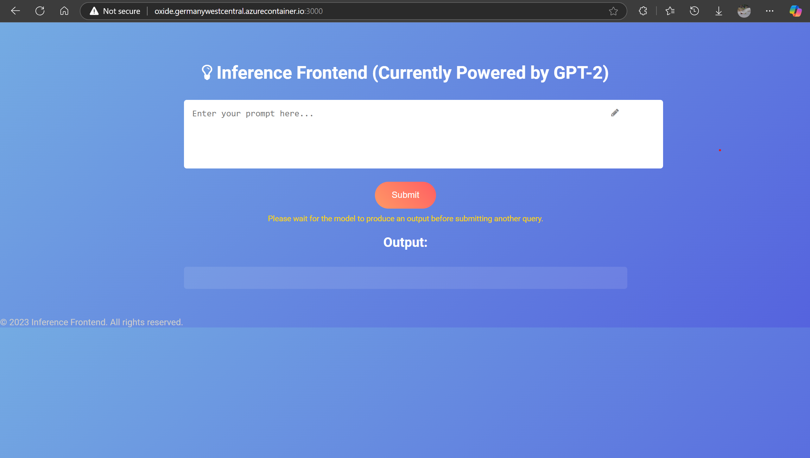

# Oxide
Oxide is a lightweight containerized model inferencing server built without unnecessary  frameworks! 🦀

---



*Oxide Home Page*

---

## Features
- Inferences custom models on any hardware you want.
- Choose between custom tokenizers, full control over your model.
- incredibly  lightweight

## Installation
Installing Oxide can be done from source.

### From Source
Clone this repository,
```sh
git clone https://github.com/dawi369/Oxide.git
```

To render run server, navigate to the root of the repo directory, and run
```sh
cargo run --release 
```

<!-- ## Demos
|                         |                      |
|-----------------------------------------------------------------------|--------------------------------------------------------------------|
| [`examples/teapot.obj`](./examples/teapot.obj) rendered in block mode | [`examples/cow.obj`](./examples/cow.obj) rendered in vertices mode |

|                         |
|-----------------------------------------------------------------------|
| [UBC Formula Electric](https://www.ubcformulaelectric.com/)'s Vehicle Controller, rendered in vertices mode from an export from Altium Designer. This board drives decisions related to inverters, drive algorithms, and LV power management. If you would like to support the team of aspiring engineers behind this board and the vehicle it drives, contact `contact@ubcformulaelectric.com` for more info. | -->

## Usage
```
Oxide: Inference your custom models on the cloud!

Usage:
    curl -X POST http://<your_FQDS_or_localhost>>/inference \
    -H "Content-Type: text/plain" \
    -d "Please generate a warm welcome."
``` 
<!-- *Obtained from `t3d -h`* -->

<!-- ## Publishing
Notes for the maintainer on publishing Oxide can be found in [`PUBLISHING.md`](PUBLISHING.md). -->

## Author
(c) [David Erwin](https://www.daviderwin.me/)